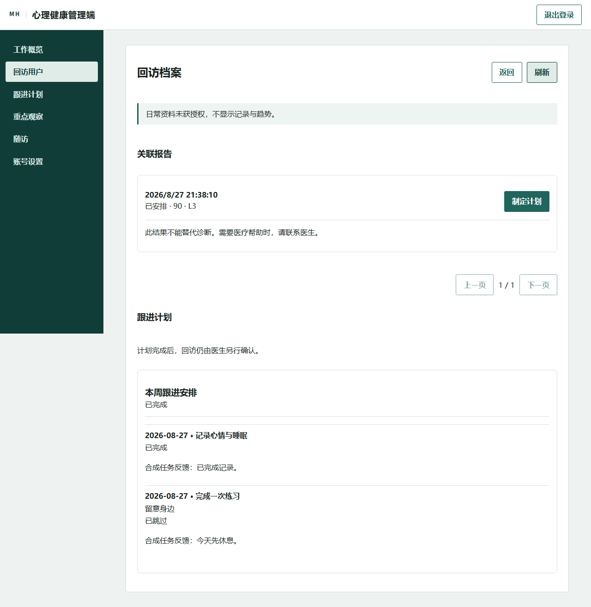

# 日常记录与回访跟进验证

日期：2026-08-27。开发基线为 `feature/phone-sms-login` 的 `c2a861b`，实现位于独立工作树的 `feature/care-continuity`。原短信登录分支保持不变。提交与远端状态以 Git 记录为准；未创建 PR 或部署。

## 已通过的检查

| 检查 | 结果 |
| --- | --- |
| .NET 解决方案构建 | 0 警告、0 错误 |
| .NET 单元测试 | 143/143 |
| .NET 契约测试 | 96/96 |
| 新增接口及原回访流程集成测试 | 12/12；独立 PostgreSQL 18.4、Redis 5.0.14.1 |
| 管理端测试 | 35/35 |
| 管理端生产构建 | 通过 |
| Flutter 静态分析 | 无问题 |
| Flutter 单元与组件测试 | 最终整套运行 56/56 |
| 管理端真实浏览器流程 | 发布、重启后回读与撤回授权两阶段通过 |
| Android 新增业务流程 | 记录与授权、反馈、API 重启后回读三阶段通过 |
| Android 原有流程回归 | 模拟订单、20 条双向持久化消息、离线 AI 求助提示均通过 |
| 普通 Android Debug APK | 清除测试构建后，以 `lib/main.dart` 无测试定义重新构建，通过凭据及测试入口扫描 |

接口测试覆盖每日唯一记录、重复提交、版本冲突、分页、日期与输入、缺失日期、用户隔离、授权与撤回、改派再改回、运营和咨询师拒绝访问、计划草稿与发布、任务反馈、导出及清除。旧回访接口补充四项越权回归：取消、完成、改期和改派；修复前四项失败，修复后全部通过。正常负责人改派、新负责人改期、原流程完成回访，以及未分派回访的既有安排流程也通过。

联调中还修复了后台分析进程单独启动时缺少依赖注册的问题，并增加启动依赖测试。迁移在独立库执行，新表与回访分派版本可用，没有对原演示数据库执行迁移或清除。

## 本地完整流程

使用临时签名密钥、合成账号、独立数据库、Redis、对象目录、API 与分析进程；未发送真实短信。

1. 经既有接口建立合成咨询、完成会话并提交转写，后台分析读取转写。
2. 用受控测试工具调用既有评分阶段，生成持久化报告及回访。
3. Android 保存心情、睡眠和简短备注，从本人咨询列表进入会话与报告，明确授权回访医生共享日常资料。
4. 医生浏览器读取授权资料和关联报告，建立两项任务的草稿。草稿对用户不可见，医生发布后才出现。
5. Android 将记录任务标为完成、练习任务标为跳过，确认说明并提交两条合成反馈。
6. 重启 API 后，Android 及医生浏览器均回读到计划状态和反馈；计划完成没有自动完成回访。
7. 用户撤回共享后，已打开的医生档案刷新即不再显示日常记录与趋势，已提交的计划反馈仍保留。
8. 运营通过接口直接读取日常资料、医生档案或计划均被拒绝，概览没有私人正文、用户标识或个体评分。
9. 医生经原接口完成回访；用户导出包包含日常记录、练习、授权与两条反馈。通过用户清除接口后，记录、练习、授权、计划、咨询及报告列表均为空，30 天趋势没有旧值，再次导出也不含新增资料，医生档案接口返回 403。

撤回共享后的医生页面（仅合成资料）：

## 尚未完成的标准回归

默认 PostgreSQL 17 / Redis 8 Testcontainers 集成套件不能启动 Docker 容器。本机 Docker 引擎管道不可用；一次完整运行中 13 项通过、118 项因环境初始化失败，不能记为集成全绿。后续新增的四项权限测试已在上述独立原生实例通过，但默认容器套件仍须补跑。

Redis 5 的局部验证不能替代 Redis 8 短信、流处理等回归。短信登录实现未被修改，相关单元与契约检查通过；本轮未实际发送短信，也不声称已完成标准容器环境的短信端到端回归。

当前后台分析流程只将转写推进到就绪状态，不自动调用评分阶段。本轮报告使用 `tests/MentalHealth.DemoScenario` 的固定合成输入调用既有阶段；这验证报告、回访和后续业务资料的持久化联动，不代表自动分析流水线验收，也不增加新评分模型或自动风险升级。

此前部分 Windows Flutter 运行出现个别用例未完成；最终串行整套运行 56/56 通过，没有据此断言发生宿主崩溃。

Android 补跑先遇到临时 API 地址缺少 `/api/v1/`、合成资料授权版本与移动端不一致的问题。修正测试地址、通过既有撤回及重新同意接口统一为 `ui-copy-v1` 后，上述流程通过。产品登录、网络安全配置及授权版本规则未被放宽。模拟器没有已安装的本地中文语音，原有文字加提示音降级及求助提示通过；不将其记为中文朗读验收。

## 复现

见 [功能、接口与演示步骤](../care-continuity.md)。自动浏览器测试为 `apps/admin_web/e2e/care-continuity.e2e.ts`；Android 测试为 `apps/mobile_flutter/integration_test/care_continuity_test.dart`。受控评分工具只接受指定前缀、非默认端口的回环测试数据库。

本记录只总结检查与实际结果，不包含令牌、签名密钥或原始私人日志。

## 临时环境清理待办

本轮启动的 API、分析进程和只读 Android 模拟器已停止，测试 APK 已由普通构建替换。最终停止独立 PostgreSQL/Redis 并删除临时目录的命令被工具执行策略拦截，未执行。验收结束时，两个隔离实例和系统临时目录仍保留，其中有合成数据库及临时测试配置；不属于代码交付，需要完成这部分清理。未改动原有数据库服务或原演示数据。

## 本地 APK

普通 Debug APK 输出位置为 `apps/mobile_flutter/build/app/outputs/flutter-apk/app-debug.apk`，不纳入 Git。此次本地构建为 206,015,107 字节，SHA-256：`E3B909CB4FDD4024DC965C35FF7D52FB46379B73916F79734D86E7CE8AFF0E7D`。

测试构建、该工作树的相关 Gradle/Flutter 构建缓存已先清除，随后不带测试定义构建。检查 APK 的 Dart 内核，未发现 JWT、`USER_ACCESS_TOKEN` 或测试入口文件。构建仍有既有第三方插件的 Kotlin Gradle Plugin 和 Java 过时警告，本轮没有升级这些依赖。
